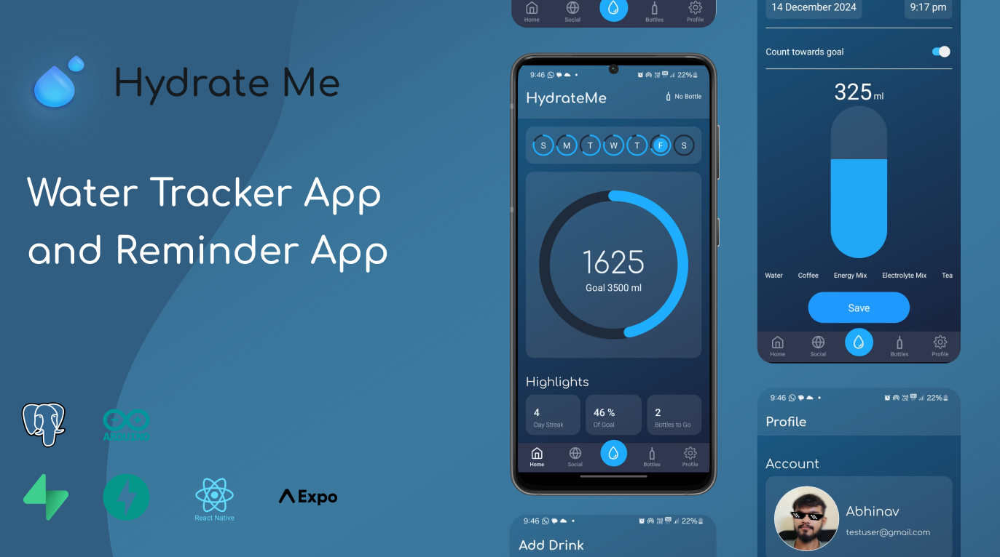

# Hydrate Me



## This is a community project

## Overview
Hydrate Me is a full-stack application designed to help users track their daily water consumption. This project combines a mobile application and an IoT device to provide a seamless and efficient way to monitor hydration. Users can log their water intake manually via the app or rely on the IoT Dock to automatically track their water intake through strain gauges (basically tracking the change in weight of water, as its density is 1g/ml).

---

## Features

### **Mobile Application**
- **Manual Logging:** Users can manually log their water intake with just a few taps.
- **Daily Goals:** Set daily hydration goals and track progress.
- **Insights:** Visualize water consumption trends over days, weeks, or months.
- **Notifications:** Get timely reminders to drink water.

### **IoT Dock**
- **Automatic Tracking:** The IoT Dock uses strain gauges to measure and log water intake in real-time.
- **Syncing:** Automatically syncs data with the app over the network.
- **Smart Alerts:** Warns users if their hydration level is significantly below the daily goal.
- **Data Logging:** Keeps a history of all water intake measurements.

---

## How It Works

### **IoT Device**
The IoT Dock is equipped with:
1. **Strain Gauge Sensor:** Measures the volume of water consumed in milliliters.
2. **Wi-Fi Connectivity:** Syncs with the backend server to update user profiles in real-time.
3. **User Identification:** Associates intake data with a specific user via a unique identifier (e.g., sensor ID).

When a user drinks water, the IoT Dock logs the intake and updates the backend. The data is then accessible through the mobile application.

### **Mobile Application**
The app complements the IoT Dock by:
- Allowing users to manually log water intake if needed.
- Providing real-time updates on their hydration status.
- Sending reminders to ensure users meet their hydration goals.

---

## Technology Stack

### **Frontend**
- **React Native:** Cross-platform app development for Android and iOS.
- **Expo:** Streamlined development and deployment.

### **Backend**
- **Supabase:** A self-hosted backend for managing user authentication and water intake data.
- **PostgreSQL:** Database for storing user profiles and water intake records.
- **FastAPI:** Lightweight and efficient backend framework.

### **IoT Device**
- **Hardware:** Custom-built IoT Dock using microcontrollers and strain gauge sensors.
- **Software:** Programmed with ESPHome for seamless integration.


## Setting Up the Project

### Prerequisites
- Node.js and npm for the app.
- Supabase for the backend.
- IoT Dock hardware.

### Steps
1. Clone the repository:
   ```bash
   git clone https://github.com/Abhinav-Prajapati/hydrate-me.git
   cd hydrate-me
   ```

2. Set up the backend:
   - Deploy Supabase and configure the database schema.
   - Update the backend configuration file with your Supabase keys.

3. Run the FastAPI backend:
   ```bash
   python -m venv venv 
   source venv/bin/activate
   pip install -r requirements.txt
   python main.py
   ```

4. Run the Expo app:
   ```bash
   cd frontend
   npm install
   npm start
   ```

5. Configure the IoT Dock:
   - Update the firmware configuration file with your Wi-Fi and backend details.

6. Test the setup by adding water intake data manually and automatically via the IoT Dock.

---


## Additional Information
I will soon be uploading the code, CAD, and circuit diagram to build the IoT Dock.

---

## Hackathon Achievement
This project won 1st position in a hackathon! (adding certificate link soon)

* Future updates will include AI-powered hydration recommendations based on user activity and weather conditions.
* Integration with wearable devices like smartwatches is planned to enhance hydration tracking accuracy.
* A community feature may be introduced, allowing users to set group hydration challenges with friends.
* Plans are in place to support voice commands for logging water intake hands-free.
---
